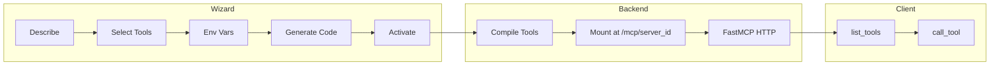

# MCP Server Generation: Wizard to Tool Execution

## High-Level Flow



## Detailed Flow

```mermaid
flowchart TB
    subgraph Step0["Step 0: Describe (Frontend)"]
        A[User describes system in chat] --> B[Technical details optional]
        B --> C[POST /wizard/start]
    end

    subgraph Step1["Step 1: Tools"]
        C --> D[Create MCPServer in DB]
        D --> E[Background: step_1a_suggest_tools]
        E --> F[LLM → step_1_tool_suggestion.yaml]
        F --> G[Save tools to mcp_tools<br/>name, description, parameters_schema]
        G --> H[setup_status: tools_selection]
        H --> I[User refines? step_1b]
        I --> J[User submits selected tools step_1c]
        J --> K[Delete unselected tools]
    end

    subgraph Step2["Step 2: Env Vars"]
        K --> L[step_2a_suggest_env_vars]
        L --> M[LLM suggests env vars]
        M --> N[User submits values step_2c]
    end

    subgraph Step3["Step 3: Auth"]
        N --> O[step_3_set_header_auth]
        O --> P[Generate Bearer token, save to DB]
    end

    subgraph Step4["Step 4: Code Generation"]
        P --> Q[step_4_generate_code]
        Q --> R[For each tool: LLM generates body only<br/>step_4_code_generation.yaml]
        R --> S[Update tool.code in DB]
        S --> T[setup_status: code_gen]
    end

    subgraph Step5["Step 5: Deploy"]
        T --> U[POST /servers/server_id/activate]
        U --> V[Load server + tools from DB]
        V --> W[For each tool: tool_loader.compile_tool]
        W --> X["Body-only: build from schema + body<br/>Legacy: exec code, override params"]
        X --> Y[FunctionTool.from_function]
        Y --> Z[register_new_customer_app]
        Z --> AA[app.mount /mcp/server_id, mcp_sub_app]
        AA --> AB[Create Deployment record ACTIVE]
        AB --> AC[setup_status: ready]
    end

    subgraph Startup["FastAPI Startup (restore on restart)"]
        AD[lifespan] --> AE[load_and_register_all_mcp_servers]
        AE --> AF[Query active shared deployments]
        AF --> AG[For each: compile tools, register_new_customer_app]
        AG --> AA
    end

    subgraph MCPClient["MCP Client Execution"]
        AA --> AH[Client connects via HTTP/SSE<br/>StreamableHttpTransport]
        AH --> AI[GET/POST /mcp/server_id/mcp]
        AI --> AJ[client.list_tools]
        AJ --> AK[FastMCP → tools with inputSchema]
        AK --> AL[client.call_tool with name and args]
        AL --> AM[FastMCP validates args, runs FunctionTool.run]
        AM --> AN[Exec compiled function with kwargs]
        AN --> AO[Return ToolResult to client]
    end
```



## Two Paths to Mounted Server

1. **Activate (live):** User clicks deploy → `POST /activate` → `register_new_customer_app` → mount at `/mcp/{server_id}`
2. **Startup (restore):** FastAPI starts → `lifespan` → `load_and_register_all_mcp_servers` → same mount for all active deployments

## Component Summary

| Stage           | Component                                 | Responsibility                               |
| --------------- | ----------------------------------------- | -------------------------------------------- |
| **Wizard**      | `wizard.py` routes                        | Orchestrate steps, trigger background jobs   |
| **Steps**       | `WizardStepsService`                      | LLM calls, DB writes, status transitions     |
| **Storage**     | `mcp_servers`, `mcp_tools`, `deployments` | Persist server config, tool schema, code     |
| **Compilation** | `DynamicToolLoader`                       | Build FunctionTool from schema + code        |
| **Runtime**     | `shared_runtime.py`                       | Mount FastMCP sub-apps at `/mcp/{server_id}` |
| **Lifespan**    | `main.py`                                 | On startup: restore active deployments       |
| **MCP**         | FastMCP                                   | HTTP transport, list_tools, call_tool        |

## Technical Details: UI vs MCP Flow

**UI flow (Step 0 chat):** Technical details are extracted on the **frontend only**:

1. User chats in `StepZeroChat` → `/api/ai/wizard-chat` streams AI responses
2. AI includes technical specs between `---TECHNICAL_DETAILS---` and `---END_TECHNICAL_DETAILS---` markers (see `lib/wizard/prompts.ts`)
3. Frontend parses assistant messages via `extractTechnicalDetails()` and accumulates in `allTechnicalDetails`
4. On "Start", `handleStepZeroReady(description, technicalDetails)` passes both to `startWizard`
5. Backend receives `technical_details` in `POST /api/wizard/start` and stores in `server.meta`

**MCP flow (MCP Hero Wizard):** When calling `start_wizard` via MCP (e.g. from Cursor), there is no chat step. The MCP tool must accept `technical_details` as an optional parameter so callers can pass OpenAPI schemas, API specs, etc. directly. The MCP Hero Wizard's `start_wizard` tool schema includes `technical_details` for this. If the deployed wizard MCP server's tool was created before this was added, its `parameters_schema` in the DB may not include it—update the tool or recreate the wizard MCP server to support it.

## Data Flow: parameters_schema

```
DB (mcp_tools.parameters_schema)     →  Single source of truth
    ↓
tool_loader.compile_tool(parameters=...)
    ↓
Body-only: _build_function_from_schema()  →  async def name(param: type = Field(description=...)): body
Legacy:    exec(code) + override tool.parameters
    ↓
FunctionTool  →  to_mcp_tool()  →  inputSchema for MCP clients
```
